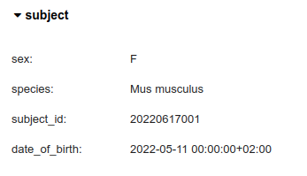
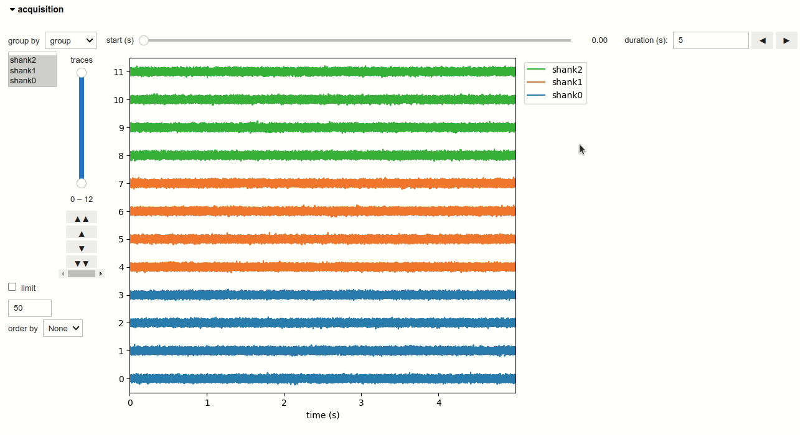

# Neurodata widgets

## Session metadata
Experimental sessions metadata is stored in the `pynwb.NWBFile` object in NWB files and is rendered as a widget by the `nwbwidgets.file.show_nwbfile` function.

## Subject metadata
Subejct's metadata is stored in the `pynwb.file.Subject` object in NWB files and is rendered as a widget by the `nwbwidgets.base.show_fields` function.

## Extracellular electrophysiology series
Ecephys series are stored in `pynwb.ecephys.ElectricalSeries` objects in NWB files and are rendered as a widget by `nwbwidgets.ecephys.ElectricalSeriesWidget`.

## Units
Units spiking activity is stored in `pynwb.misc.Units` objects in NWB files and can be rendered as multiple widgets: `nwbwidgets.dynamictablesummary.DynamicTableSummaryWidget`, `nwbwidgets.misc.RasterWidget`, `nwbwidgets.misc.PSTHWidget`, `nwbwidgets.misc.RasterGridWidget`, `nwbwidgets.misc.TuningCurveWidget` and `nwbwidgets.misc.TuningCurveExtendedWidget`.

## Intracellular electrophysiology series
Icephys series are stored in `pynwb.icephys.PatchClampSeries` and organized in `pynwb.icephys.IntracellularRecordingsTable` objects in NWB files. Those objects are rendered as widgets by `nwbwidgets.dynamictablesummary.DynamicTableSummaryWidget`, `nwbwidgets.icephys.IVCurveWidget` and the `nwbwidgets.view.show_dynamic_table` function.

## Spatio-temporal behavioral series
Behavioral spatio-temporal data is stored in `pynwb.behavior.SpatialSeries` objects in NWB files and are rendered as a widget by the `nwbwidgets.behavior.route_spatial_series` function.

(EXAMPLE_GIF)

## Optophysiology data
Optophysiology data can be stored as multiple objects in a NWB file: `pynwb.ophys.ImageSegmentation`, `pynwb.ophys.TwoPhotonSeries`, `pynwb.ophys.PlaneSegmentation`, `pynwb.ophys.DfOverF` and `pynwb.ophys.RoiResponseSeries`. Those objects are rendered as widgets by `nwbwidgets.ophys.show_image_segmentation`, `nwbwidgets.ophys.TwoPhotonSeriesWidget`, `nwbwidgets.ophys.route_plane_segmentation`, `nwbwidgets.ophys.show_df_over_f` and `nwbwidgets.ophys.RoiResponseSeriesWidget`.

(EXAMPLE_GIF)

