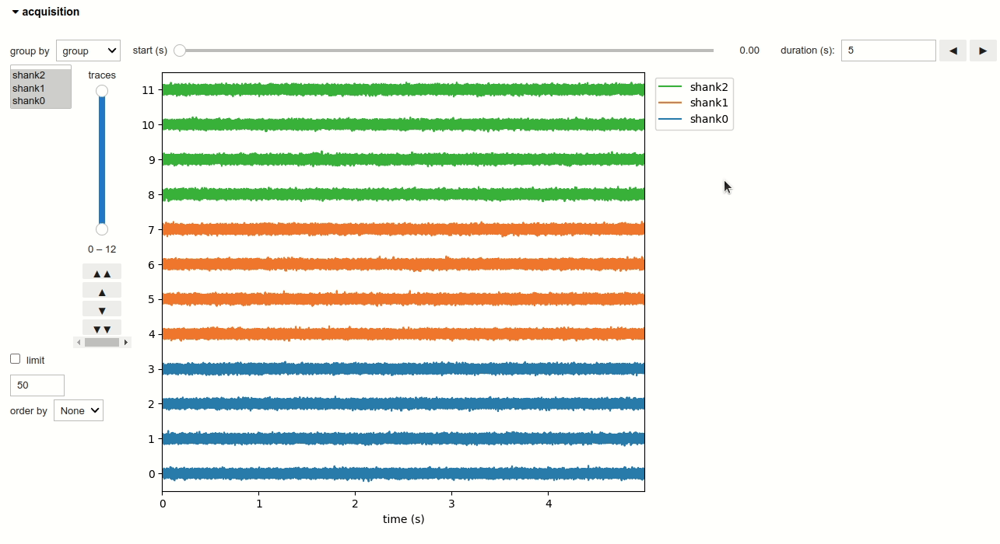
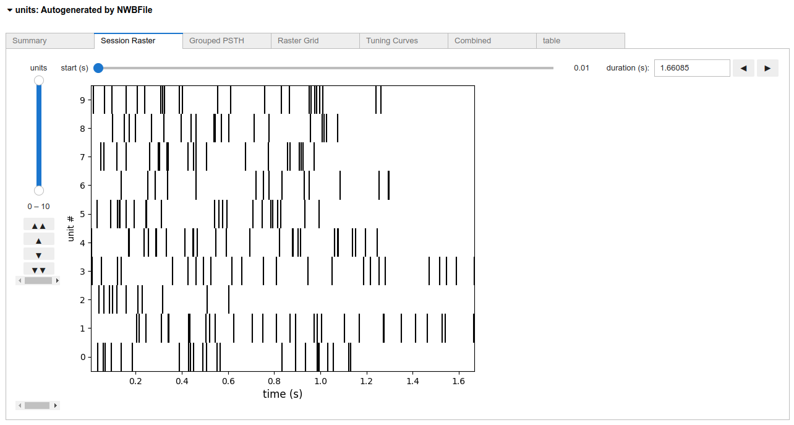

Extracellular electrophysiology
-------------------------------

ElectricalSeries
================
Voltage series from intracranial electrodes are stored in :py:class:`~pynwb.ecephys.ElectricalSeries` objects in NWB
files and are rendered as a widget by :py:class:`~nwbwidgets.ecephys.ElectricalSeriesWidget`.

Units
=====
Units spiking activity is stored in :py:class:`~pynwb.misc.Units` objects in NWB files and can be rendered as multiple
widgets: :py:class:`~nwbwidgets.dynamictablesummary.DynamicTableSummaryWidget`

:py:class:`~nwbwidgets.misc.RasterWidget`:

:py:class:`~nwbwidgets.misc.PSTHWidget`,

:py:class:`~nwbwidgets.misc.RasterGridWidget`,

:py:class:`~nwbwidgets.misc.TuningCurveWidget` and

:py:class:`~nwbwidgets.misc.TuningCurveExtendedWidget`.
