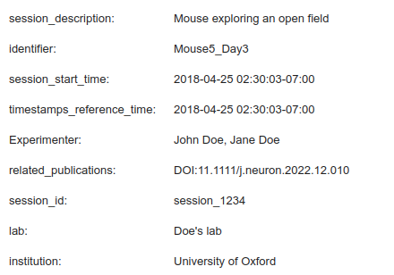
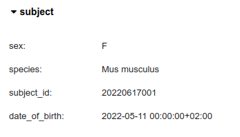

File
----

Session metadata
================
Experimental sessions metadata is stored in the :py:class:`~pynwb.file.NWBFile` object in NWB files and is rendered
as a
widget by
the :py:func:`~nwbwidgets.file.show_nwbfile` function.

Subject metadata
================
Subject's metadata is stored in the :py:class:`~pynwb.file.Subject` object in NWB files and is rendered as a widget by
the :py:func:`~nwbwidgets.base.show_fields` function.

