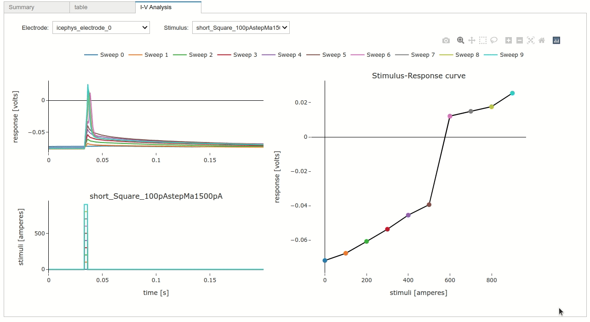

Intracellular electrophysiology
-------------------------------

IntracellularRecordingsTable
============================

Icephys series are stored in :py:class:`~pynwb.icephys.PatchClampSeries` and organized in
:py:class:`~pynwb.icephys.IntracellularRecordingsTable` objects in NWB files. Those objects are rendered as widgets by
:py:class:`~nwbwidgets.dynamictablesummary.DynamicTableSummaryWidget`, :py:class:`~nwbwidgets.icephys.IVCurveWidget` and the
:py:func:`~nwbwidgets.view.show_dynamic_table` function.

