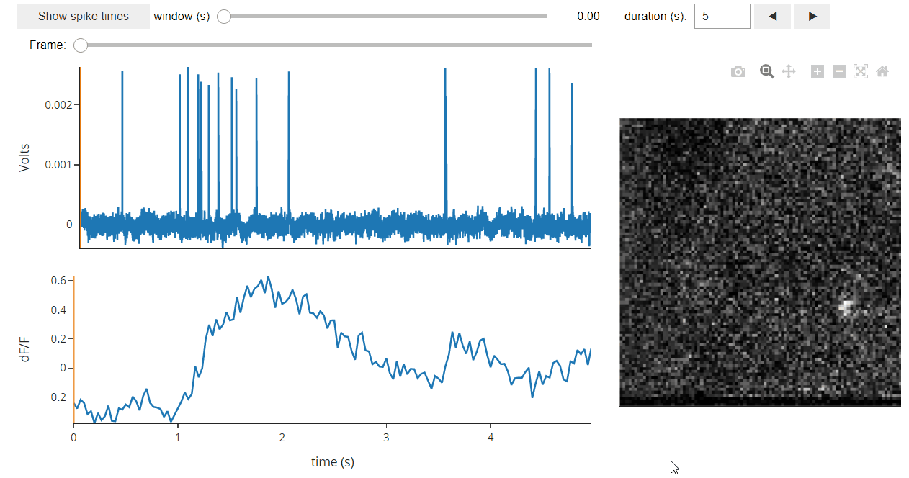

# Dashboards
NWBWidgets can be used for the creation of customized Dashboards by using its modular components.

# Examples
## Allen Dashboard
```python
from pynwb import NWBHDF5IO
from nwbwidgets.dashboards.allen import AllenDashboard

fpath = 'path_to_dir/file.nwb'
io = NWBHDF5IO(fpath, mode='r')
nwb = io.read()

app = AllenDashboard(nwb)
app
```


